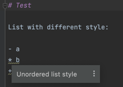
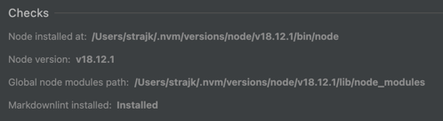

# intellij-plugin-markdownlint

<!--

[](https://plugins.jetbrains.com/plugin/PLUGIN_ID)
[](https://plugins.jetbrains.com/plugin/PLUGIN_ID)
-->

<!-- Plugin description -->
Support for [markdownlint](https://github.com/DavidAnson/markdownlint) in IntelliJ IDEs.

**BEWARE: This is my first ever Kotlin project, and first ever plugin – so handle with care and don't hesitate to submit issues/PRs on GitHub.**
<!-- Plugin description end -->



#### Story-time explaining what this is and what it isn't.

I like markdownlint and Jetbrains IDEs.  
I wanted to to try out Kotlin and IntelliJ Platform Plugin Development – had no experience with either.  
I had some spare time for it, but it's a fun experiment and should not be considered as serious polished project.  
**It's working, I'm using it myself, but it's far from perfect.**  
I'm open for contributions, advices, ideas, but I in all honesty, I probably will not be actively working on it.


## Installation

> **Important**
>
> To use this plugin, you need to have
> * `markdownlint-cli2` globally installed and available in your `PATH` (`npm i -g markdownlint-cli2`)
> * `node` installed and available in your `PATH`
> Check plugin settings to verify that everything is set up correctly.
> 

- ~~Using IDE built-in plugin system~~: 🚫 NOT YET PUBLISHED 🚫
  
  <kbd>Settings/Preferences</kbd> > <kbd>Plugins</kbd> > <kbd>Marketplace</kbd> > <kbd>Search for "intellij-plugin-markdownlint"</kbd> >
  <kbd>Install Plugin</kbd>
  
- Manually:

  Download the [latest release](https://github.com/Strajk/intellij-plugin-markdownlint/releases/latest) and install it manually using
  <kbd>Settings/Preferences</kbd> > <kbd>Plugins</kbd> > <kbd>⚙️</kbd> > <kbd>Install plugin from disk...</kbd>


## FAQ

### It's slooow!

I know, but I don't know how to make it faster. I'm open to suggestions. This is my first ever Kotlin project so I probably did something wrong.

### Getting `java.io.IOException: Cannot run program "node"`

Your IDE does not have `node` in its `PATH`. 
If you have node installed and it works elsewhere (e.g. in the terminal), 
the probable cause is that your "normal" `PATH` is not the same as the `PATH` used by IntelliJ.
That's usually caused by a custom `.bashrc`/`.zshrc`/`...` that adjust your `PATH` for your terminal, but not for IntelliJ IDEs.
**Hotfix** is to launch your IDE from the terminal, so that it inherits your `PATH` from the terminal.
```
open -a "WebStorm"` on macOS
`webstorm` on Linux
`webstorm.exe` on Windows
```
Read more on [StackOverflow](https://stackoverflow.com/questions/15201763/intellij-does-not-recognize-path-variable).

Proper fix would be to not use `node` from the plugin, but I simply don't know how to do that yet ¯\_(ツ)_/¯

<details>
<summary>💡 Possible solution: Use "IDE's" node</summary>

Maybe rather than depending on system `node`, we could:

- specify `NodeJs` in `platformPlugins` in `gradle.properties` to require Node
- use `NodeJsInterpreter`
- StLint seems to work that way, maybe we can take inspiration from there

</details>

## Feature parity with "official" [VSCode extension](https://github.com/DavidAnson/vscode-markdownlint)

- [ ] [Fixing](https://github.com/DavidAnson/vscode-markdownlint#fix)
- [ ] [Config detection](https://github.com/DavidAnson/vscode-markdownlint#markdownlintconfig)
- [ ] [Focus/Zen mode](https://github.com/DavidAnson/vscode-markdownlint#markdownlintfocusmode)
- [ ] [Snippets](https://github.com/DavidAnson/vscode-markdownlint#snippets)

## Issues/Todo

- [x] Action to Fix file
- [ ] Restart action
- [ ] Add tests
- [ ] Intention to Suppress

## Development

- Plugin should be able to "Auto-Reload", but it does not work for me. I have to re-run "Run plugin" configuration every time I make a change.
- Debugging seems to work fine, at least for the "Run Plugin" configuration.
  - Does not work for me for "Run Tests" configuration. 
- Testing build by manually installing in IDE
- Run `buildPlugin` task in Gradle, not `build` task
  - zip will be in `./build/distributions` 
  - Don't forget to close IDE running from "Run plugin" configuration if you get "Execution failed for task ':buildSearchableOptions'" error
- How to debug jsCode blocks?
  - Not sure ¯\_(ツ)_/¯   

## Links

- https://github.com/Strajk/intellij-plugin-markdownlint
- https://plugins.jetbrains.com/plugin/20851-markdownlint
