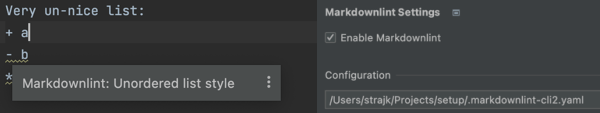

# intellij-plugin-markdownlint

<!--

-->

😱 **BEWARE: This is a work in progress. It's not ready for use yet, but I wanted to publish it to get feedback.**

<!-- Plugin description -->
This plugin integrates [markdownlint](https://github.com/DavidAnson/markdownlint) into IntelliJ IDEs.
<!-- Plugin description end -->

## Installation

- ~~Using IDE built-in plugin system~~: 🚫 NOT YET PUBLISHED 🚫
  
  <kbd>Settings/Preferences</kbd> > <kbd>Plugins</kbd> > <kbd>Marketplace</kbd> > <kbd>Search for "intellij-plugin-markdownlint"</kbd> >
  <kbd>Install Plugin</kbd>
  
- Manually:

  Download the [latest release](https://github.com/Strajk/intellij-plugin-markdownlint/releases/latest) and install it manually using
  <kbd>Settings/Preferences</kbd> > <kbd>Plugins</kbd> > <kbd>⚙️</kbd> > <kbd>Install plugin from disk...</kbd>
